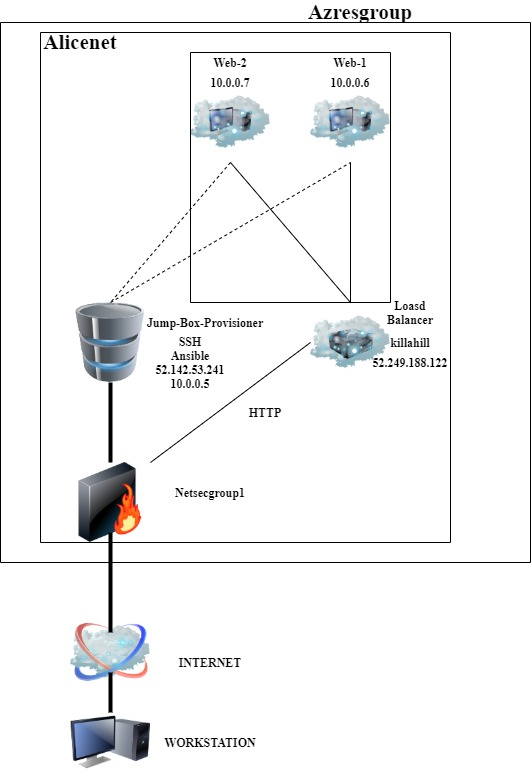

## Automated ELK Stack Deployment

The files in this repository were used to configure the network depicted below.

These files have been tested and used to generate a live ELK deployment on Azure. They can be used to either recreate the entire deployment pictured above. Alternatively, select portions of the `Yaml` file may be used to install only certain pieces of it, such as Filebeat.

  - !(Ansible/pentest.yml)

This document contains the following details:
- Description of the Topologu
- Access Policies
- ELK Configuration
  - Beats in Use
  - Machines Being Monitored
- How to Use the Ansible Build

### Description of the Topology

The main purpose of this network is to expose a load-balanced and monitored instance of DVWA, the D*mn Vulnerable Web Application.

Load balancing ensures that the application will be highly `accessible`, in addition to restricting `stress` to the network.
- What aspect of security do load balancers protect? What is the advantage of a jump box?
  - Load balancer protect the availability of the servers. Jumpbox will act as a buffer between the outside world and the backend of the webservers

Integrating an ELK server allows users to easily monitor the vulnerable VMs for changes to the `configurations` and system `files`.
- What does Filebeat watch for?
  - Filebeat monitors for SSH logins, linux accounts logins, and sudo commands.
- What does Metricbeat record?
  - Metricbeat will monitor for CPU, RAM, and network usage.

The configuration details of each machine may be found below.
_Note: Use the [Markdown Table Generator](http://www.tablesgenerator.com/markdown_tables) to add/remove values from the table_.

| Name     | Function | IP Address | Operating System |
|----------|----------|------------|------------------|
| Jump Box | Gateway  | 10.0.0.5  | Linux            |
| Webserver1    |  Web Server        |  10.0.0.6       |      Linux            |
| Webserver2 | Web Server         | 10.0.0.7     |       Linux           |
| ELK-Server  | SIEM        |  10.1.0.4 | Linux                  |

### Access Policies

The machines on the internal network are not exposed to the public Internet. 

Only the `Webserver` machine can accept connections from the Internet. Access to this machine is only allowed from the following IP addresses:
- SSH Logins are only from the Jumpbox but public HTTP access can be accses via the internet.

Machines within the network can only be accessed by `jumpbox`.
- Which machine did you allow to access your ELK VM? What was its IP address?_
  - Jumpbox is the only machine that can access the ELK VM via SSH
  - My computer is the only machine that can access the ELK VM with Kibana via port 5601.

A summary of the access policies in place can be found in the table below.

| Name     | Publicly Accessible | Allowed IP Addresses |
|----------|---------------------|----------------------|
| Jump Box | No            | my personal ip    |
|  Webserver1        |        Yes             |     10.0.0.6
|Webserver2|yes|10.0.0.7
|   ELK       |            No         |              10.1.0.4        |

### Elk Configuration

Ansible was used to automate configuration of the ELK machine. No configuration was performed manually, which is advantageous because it is prone to less human errors and speeds up the deployment process and can install modules simultaneously.
- What is the main advantage of automating configuration with Ansible?
    - The main advantage of automating configurations with Ansible is to make less mistakes and to save time. 

The playbook implements the following tasks:
- _TODO: In 3-5 bullets, explain the steps of the ELK installation play. E.g., install Docker; download image; etc._
- Install docker.io
- Install pip3
- Install Docker python module
- Use more memory and configure it to 2.6GB of RAM for ELK
- Download and launch a docker elk container

The following screenshot displays the result of running `docker ps` after successfully configuring the ELK instance.

### Target Machines & Beats
This ELK server is configured to monitor the following machines:
- List the IP addresses of the machines you are monitoring
  - 10.0.0.5 and 10.0.0.6 

We have installed the following Beats on these machines:
- We have installed filebeat and metricbeat

These Beats allow us to collect the following information from each machine:
- _TODO: In 1-2 sentences, explain what kind of data each beat collects, and provide 1 example of what you expect to see. E.g., `Winlogbeat` collects Windows logs, which we use to track user logon events, etc._
  -  Filebeat collects ssh logins, linux logins, and sudo commands
  -  Metricbeat collects CPU, RAM, and network usage.

### Using the Playbook
In order to use the playbook, you will need to have an Ansible control node already configured. Assuming you have such a control node provisioned: 

SSH into the control node and follow the steps below:
- Copy the /etc/ansible/filebeat-config.yml file to /etc/filebeat/filebeat-config.yml.
- Update the `hosts` file to include the webserver group
- Run the playbook, and navigate to `/etc/filebeat/` to check that the installation worked as expected.

Answer the following questions to fill in the blanks:
- _Which file is the playbook? Where do you copy it?_
  - `filebeat.yml`, `pentest.yml`, and `metricbeat.yml` should all be in the `/etc/ansible`
- _Which file do you update to make Ansible run the playbook on a specific machine? How do I specify which machine to install the ELK server on versus which to install Filebeat on?_
  -  `hosts` file 
- _Which URL do you navigate to in order to check that the ELK server is running?
  -  `http://40.86.174.196:5601`  
